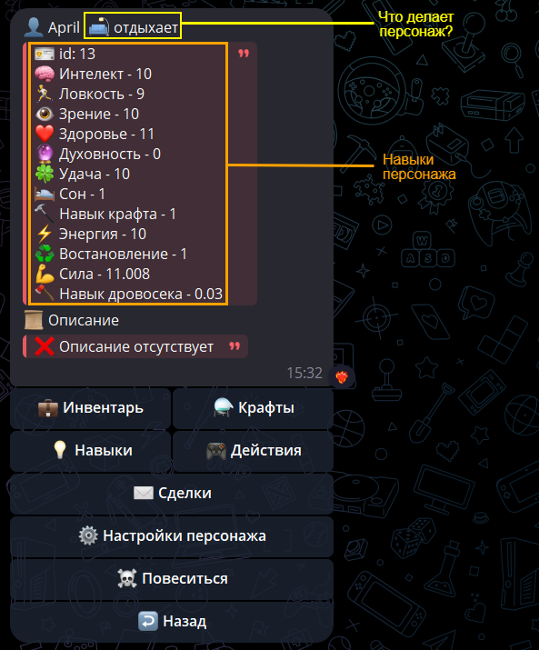
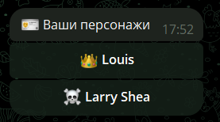
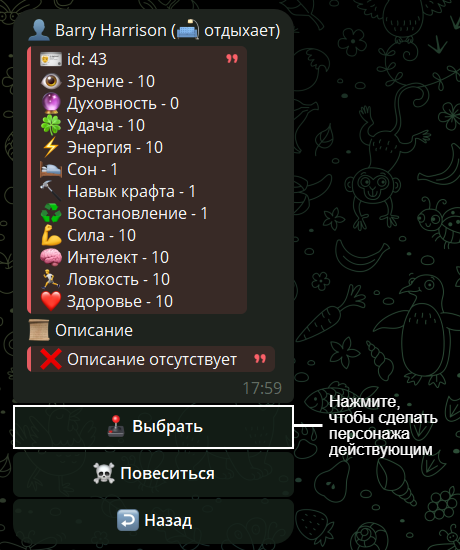

# 👤 Персонажи

---

## 🏠 Начало {#main}

Всем игрокам в начале доступно создание одного персонажа и одно удаление персонажа.
Чтобы создать персонажа посмотрите [гайд](new.md).

> ❗ Подписчики [Газеты Старого Нила](https://t.me/oldneal) получают возможность
создать еще одного персонажа

<!--infochar-start-->

---

## 👑 Действующий персонаж {#main_char}

Это персонаж, которым мы сейчас управляем. Меню действующего персонажа открывается с помощью команды /mychar. 

[`💼 Инвентарь`](../item/base.md#inventory) - Открывает инвентарь

[`⚗️ Крафты`](../craft/base.md) - Посмотреть доступные крафты

[`💡 Навыки`](../skill/base.md) - Открывает список навыков

[`🎮 Действия`](../action/base.md) - Меню с действиями

[`✉️ Сделки`](../transfer/base.md) - Посмотреть свои сделки

`⚙️ Настройки персонажа` - Открыть настройки персонажа

`☠️ Повеситься` - Использовать удаление персонажа. Умерший персонаж больше не может быть действующим персонажем. Все предметы в его инвентаре остаются с ним. После смерти этого персонажа вы сможете создать нового.

> ❗Важно иметь действующего персонажа перед тем как продолжать пользоваться ботом. 
При создании он выбирается автоматически, но если умрет действующий персонаж, нужно выбрать самому другого.

<!--infochar-end-->

---

## 👥 Другие персонажи {#chars}

Другие ваши персонажи продолжать действовать и вам будут приходить уведомления, связанные с ними. Чтобы переключить персонажа отправьте боту команду /mychars и он откроет вам список персонажей, в том числе и мертвых.

Выбираем нужного персонажа

Теперь ваш персонаж действующий.

