# ➕ Создание нового персонажа

## 🏠 Начало

Чтобы создать нового персонажа отправьте боту команду /newchar для создания персонажа. После этого выбираем пол будущего персонажа.

<!--newchar-start-->

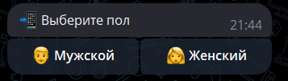{width=40%}

Мы получаем такое сообщение

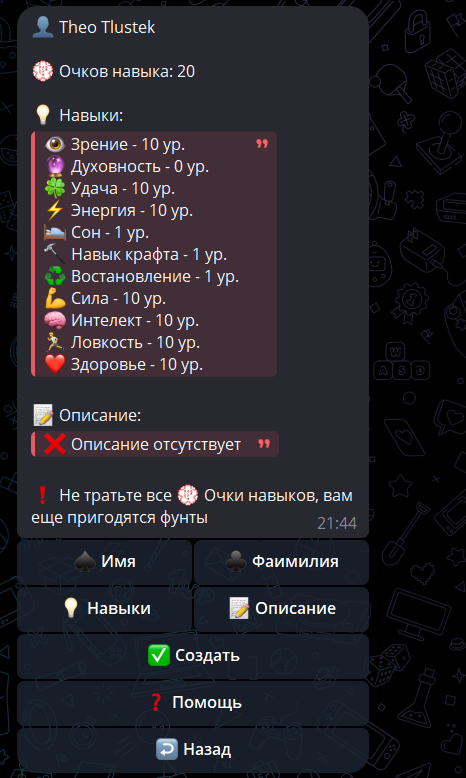{width=50%}

`👤 Theo Tlustek` - Имя и Фаимилия вашего персонажа, чтобы изменить нажмите на соотвествующую кнопку.

`💮 Очков навыка: 20` - Количество доступных очков навыка, коротко ОН.

`📝 Описание` - Описание вашего персокажа. Можно менять.

`💡 Навыки` - Навыки вашего персокажа и их уровни.

Если все нравится - нажимаем на кнопку `✅ Создать`.

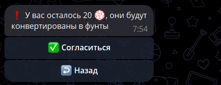{width=60%}

Ваши оставшиеся ОП будут конвертированы в 💷 Фунты (Игровую валюту). Курс 1 💮 ОН => 1 💷 Фунт.

<!--newchar-end-->

Нажав на кнопку `✅ Согласиться`, вы создадите себе нового персонажа.

---

## ✏️ Изменение имени и фамилии

---

Всего в боте досутпны имена из 6 стран:

 - Англия
 - Германия
 - Россия
 - Франция
 - Италия
 - США

Если нужно изменить имя, нажимаем на кнопку `♠️ Имя`

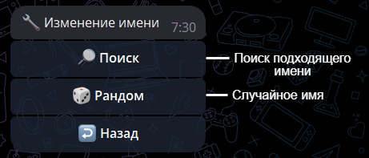{width=75%}

или на кнопку `♣️ Фаимилия`

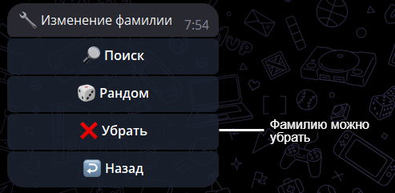{width=75%}

Если нужно конкретное имя/фамилия, то нажимаем на `🔎 Поиск` и отправляем боту часть имени/фамилии:

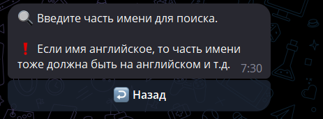{width=75%}

> ❗ Если имя/фамилия на английском, то важно, чтобы его часть была тоже на английском.

>  Например, если нужно James вводим Ja.

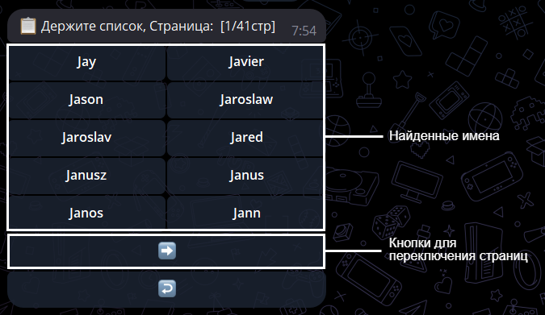{width=75%}

Перелистываем и нажимаем на нужное имя/фамилию.

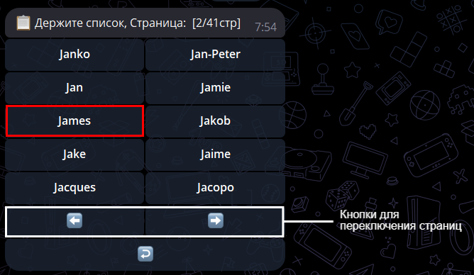{width=75%}

Также можно выбрать сулчайное имя:

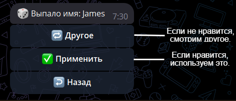{width=75%}

---

## 💡 Изменение навыков создаваемого персонажа

---

Нажимаем на кнопку `💡 Навыки`

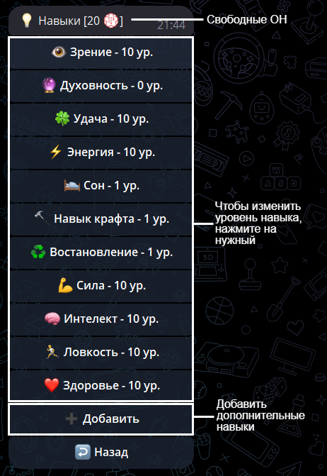{width=50%}

Нажимаем на навык, который хотим изменить. 

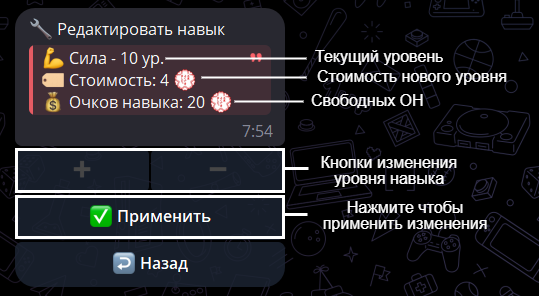{width=50%}

> ❗ Добавляя уровень, мы платим ОН, указанные в стоимости. Если же уменьшать уровень, мы получим компенсацию в соотвествии со стоимостью.

Навыки делятся на 2 типа:

- Базовые (их нельзя убрать из списка навыков и нельзя уменьшить ниже определенного уровня)

- Дополнительные (можно убрать из списка навыков)

Если мы попытаемся уменьшить уровень базового навыка ниже определенного, мы получим ошибку:

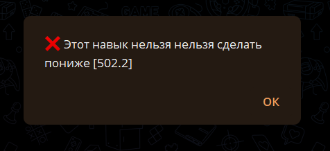{width=50%}

Если то же самое провести с дополнительным навыком, то при уровне равном 1, навык исчезнет из списка навыков.
