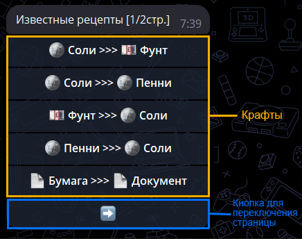
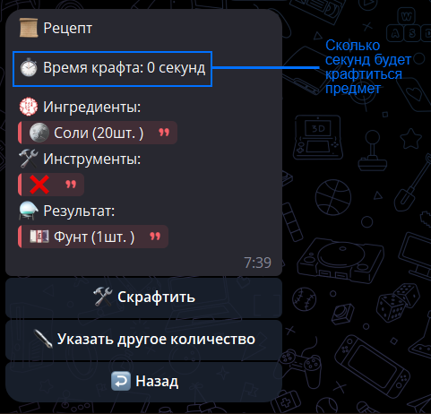
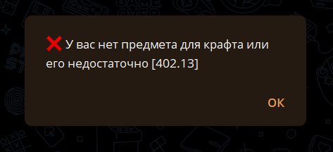
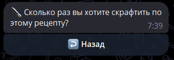
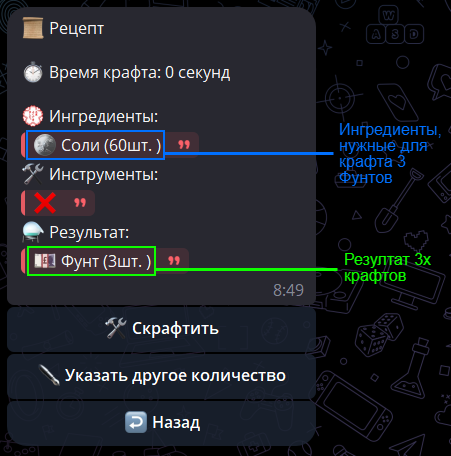
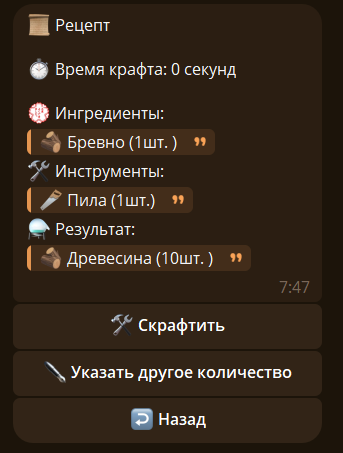
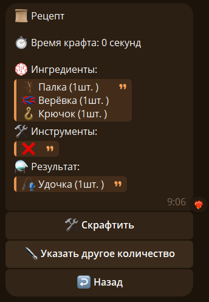
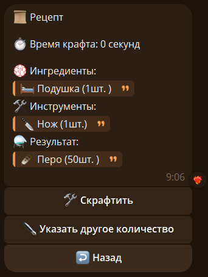
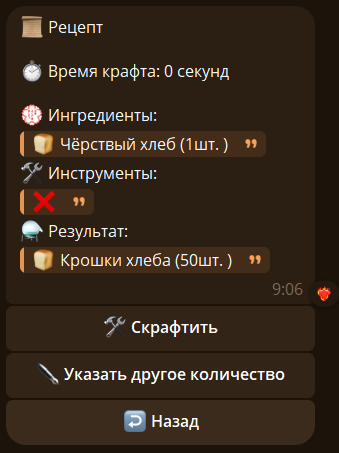

# ⚗️ Крафты

---

## 🏠 Начало {#main}

<!--craft-start-->

С помощью крафтов вы можете получать нужный предмет.

Откроем список крафтов командой /craft

Ищем нужный крафт и открываем его

`💮 Ингредиенты` - Предметы нужные для крафта важно иметь с количеством в инвентаре.

`🛠️ Инструменты` - Инструменты для крафта, необязательны для некотрых крафтов (если не нужно, то '❌').

`⚗️ Результат` - Предметы получаемые в процессе крафта.

Чтобы скрафтить нужный предмет нажмите кнопку `🛠️ Скрафтить`. Если крафт успешный, то мы получаем такое сообщение:

Если же не хвататет ингредиентов или нету инструменты то:

<!--craft-end-->

---

## ✏️ Результат с нужным количеством {#x}

Если вас нужно другое количество результата крафта, нажмите кнопку `✒️ Указать другое количество`

Отправляем нужное количество крафтов

> ❗ Важно: если для крафта нужны инструменты, то они не меняются и не увеличиваются в количестве, как ингредиенты или результат.

---

## 📋 Примеры крафта {#examples}

