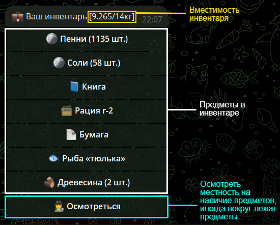
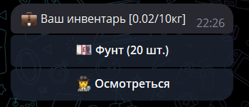
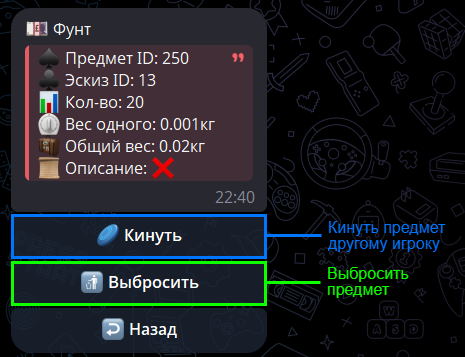
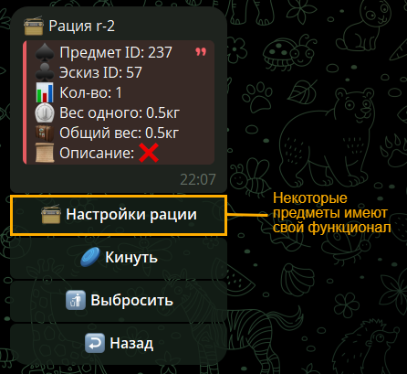

# Предметы

Каждый предмет имеет свой вес, некоторые имеют свой функционал или описание.

> ➕ Вы можете создать свои преметы, гайд [тут](create.md).

<!--inventory-start-->

## 👜 Инвентарь {#inventory}

Инвентарь имеет размер, обычно он равен `💪 Силе` вашего персонажа.

Чтобы открыть инвентарь отправьте команду /inventory. 

{width=40%}

> ❗ В примере показан инвентарь уже старого персонажа. Вот как будет выглядить инвентарь нового персонажа.

> {width=20%}

Нажав на предмет, мы можем увидеть его ID, вес и количество.

{width=40%}

Или если предмет с функционалом:

{width=40%}

<!--inventory-end-->
